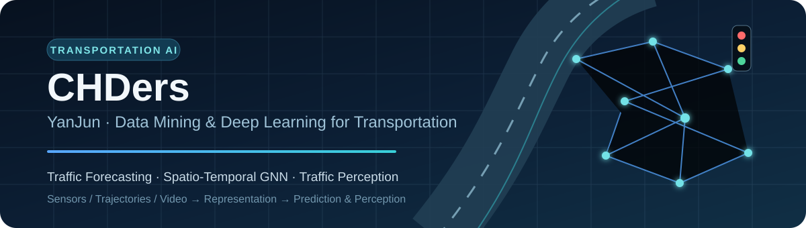
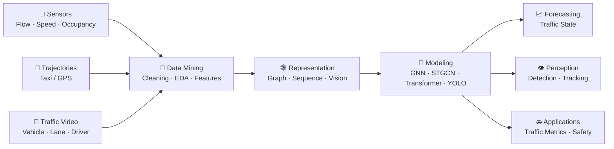
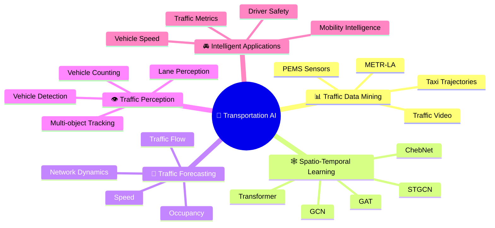

<p align="center">
  
</p>

<div align="center">

### 🚦 Transportation Data Mining · Spatio-Temporal Deep Learning · Intelligent Transportation

**交通数据挖掘 · 时空深度学习 · 智能交通感知**

Turning traffic data into models for **forecasting, perception and mobility intelligence**.

[GitHub](https://github.com/CHDers) ·
[Bilibili](https://space.bilibili.com/375719714) ·
[Email](mailto:chder1996@gmail.com)

</div>

---

## 👋 About Me

Hi, I'm **YanJun (CHDers)**. My main interest is **data-driven intelligent transportation**.


Compared with building a profile around a long list of generic technologies, I prefer to organize my work around one question:

> **How can traffic sensors, trajectories and videos be transformed into useful spatio-temporal representations for prediction and perception?**

```python
class CHDers:
    domain = "Transportation AI"

    research_focus = [
        "Traffic Data Mining",
        "Traffic Flow Forecasting",
        "Spatio-Temporal Graph Learning",
        "Traffic Computer Vision",
    ]

    methods = [
        "GCN", "GAT", "ChebNet", "STGCN",
        "Transformer / Informer",
        "YOLO", "OpenCV", "SORT / DeepSORT",
    ]

    data = [
        "PEMS traffic sensors",
        "METR-LA",
        "Taxi trajectories",
        "Roadside / driving video",
    ]

    goal = "Understand traffic with data, graphs and deep learning."
```


---

## 🧭 Research Focus

| Direction | What I work on | Typical methods / data |
|---|---|---|
| 🚥 **Traffic State Forecasting** | Traffic flow, speed and occupancy prediction | `PEMS` · `METR-LA` · time series |
| 🕸️ **Spatio-Temporal Graph Learning** | Modeling road-network spatial dependency and temporal dynamics | `GCN` · `GAT` · `ChebNet` · `STGCN` |
| 🎥 **Traffic Perception** | Vehicle detection, tracking, counting, lane-level volume and speed estimation | `YOLO` · `OpenCV` · `SORT/DeepSORT` |
| 🧑‍✈️ **Driver & Road Safety** | Drowsiness / yawning detection and lane perception | `dlib` · `EAR/MAR` · vision pipelines |

### From traffic data to traffic intelligence



---

# 🚀 Featured Transportation Projects

## 01 · Traffic Forecasting & Spatio-Temporal Learning

| Project | Focus | Highlights |
|---|---|---|
| **[Traffic Flow Prediction with Graph Neural Networks](https://github.com/CHDers/Traffic-Flow-Prediction-with-Graph-Neural-Networks)** | 🚥 Traffic flow forecasting | PyTorch implementations of **GCN / GAT / ChebNet** on **PEMS-04**; explores detector graph structure and flow / occupancy / speed data |
| **[STGCN-PyTorch](https://github.com/CHDers/STGCN-PyTorch)** | 🕸️ Spatio-temporal forecasting | PyTorch implementation of **STGCN** with a **METR-LA** traffic forecasting example |
| **[GCN Time-Series Prediction on Shenzhen Taxi Trajectories](https://github.com/CHDers/GCN-Time-Series-Prediction-Based-on-Taxi-Trajectory-Data-in-Shenzhen-City)** | 📍 Trajectory mining | Exploring graph-based time-series prediction using **Shenzhen taxi trajectory data** |

> 🚧 The Shenzhen taxi-trajectory repository is kept as an exploration project; its README currently notes that the required data still needs to be completed before the code can run end-to-end.

## 02 · Traffic Perception & Road Safety

| Project | Focus | Highlights |
|---|---|---|
| **[Lane-level Traffic Volume & Speed with YOLO12](https://github.com/CHDers/Detecting-traffic-volume-and-vehicle-speed-in-different-lanes-based-YOLO12)** | 🎥 Traffic video analytics | Detect vehicles and estimate **traffic volume / vehicle speed for different lanes** |
| **[Vehicle Counting with YOLO & OpenCV](https://github.com/CHDers/Vehicle-Counting-Based-on-YOLO-and-OpenCV)** | 🚗 Detection & tracking | Vehicle detection, tracking and counting pipeline with **YOLO + OpenCV** |
| **[Real-time Lane Bend Detection](https://github.com/CHDers/Real-time-lane-bend-detection-based-on-OpenCV)** | 🛣️ Lane perception | Real-time curved-lane detection using **OpenCV**, image filtering and sliding-window search |
| **[Drowsiness Detection](https://github.com/CHDers/Drowsiness-Detection)** | 🧑‍✈️ Driver safety | Driver drowsiness / yawning detection using facial landmarks and **EAR / MAR** features |

---

## 🧰 Transportation AI Toolbox

> Only technologies directly supported by the repositories highlighted above are listed here.

| Layer | Technologies / Methods |
|---|---|
| **Primary Language** | `Python` |
| **Deep Learning** | `PyTorch` |
| **Graph Learning** | `GCN` · `GAT` · `ChebNet` · `STGCN` |
| **Computer Vision** | `YOLO` · `OpenCV` · `dlib` |
| **Tracking** | `SORT` · `DeepSORT` |
| **Data Science** | `NumPy` · `Pandas` · `Matplotlib` |
| **Traffic Data** | `PEMS-04` · `METR-LA` · taxi trajectories · traffic / driving video |
| **Workflow** | `Git` · `GitHub Actions` |

<details>
<summary><b>🔬 Other ML / optimization explorations</b></summary>
<br/>

Alongside transportation research, I also explore broader machine-learning and numerical methods:

- [Solving Burgers Equation with PINNs](https://github.com/CHDers/Solving-Burgers-Equation-with-PINNs)
- [GNN Study From BiliBili](https://github.com/CHDers/GNN-Study-From-BiliBili)
- Transformer / Informer and deep time-series implementations
- Multi-GPU model training, optimization algorithms and related experiments

</details>


---

## 📊 GitHub Metrics

<!-- <p align="center">
  <a href="https://github.com/CHDers">
    
  </a>
</p> -->


<p align="center">
  
</p>


## 🧊 My 3D Contribution

<p align="center">
  <picture>
    <source media="(prefers-color-scheme: dark)" srcset="https://raw.githubusercontent.com/CHDers/CHDers/output/github-contribution-grid-snake-dark.svg" />
    <source media="(prefers-color-scheme: light)" srcset="https://raw.githubusercontent.com/CHDers/CHDers/output/github-contribution-grid-snake.svg" />
    
  </picture>
</p>

---

## 📬 Connect

<div align="center">

**Interested in Transportation AI, traffic forecasting, GNNs or traffic computer vision?**

I'm always happy to exchange ideas around **traffic data mining, spatio-temporal modeling and intelligent transportation**.

📮 **chder1996@gmail.com**  
🎬 **[Bilibili](https://space.bilibili.com/375719714)**  
💻 **[github.com/CHDers](https://github.com/CHDers)**

<br/>

<sub>🚦 Data → Graph → Model → Mobility Intelligence</sub>


</div>


<!-- ==================== ADD: Profile Badges ==================== -->

<p align="center">
  
  
  
</p>

<!-- ==================== ADD: Research Landscape ==================== -->

## 🧠 Research Landscape



<!-- ==================== ADD: Visual Tech Stack ==================== -->

## ⚙️ Visual Tech Stack

<div align="center">

### 🧠 Deep Learning & Graph Learning


<br/>

### 👁️ Computer Vision


<br/>

### 📊 Data & Development


</div>

<!-- ==================== ADD: GitHub Overview Cards ==================== -->

## 📈 GitHub Overview

<p align="center">
  <picture>
    <source
      srcset="https://github-readme-stats.vercel.app/api?username=CHDers&show_icons=true&include_all_commits=true&rank_icon=github&hide_border=true&theme=github_dark"
      media="(prefers-color-scheme: dark)"
    />
    <source
      srcset="https://github-readme-stats.vercel.app/api?username=CHDers&show_icons=true&include_all_commits=true&rank_icon=github&hide_border=true&theme=default"
      media="(prefers-color-scheme: light)"
    />
    
  </picture>

  <picture>
    <source
      srcset="https://github-readme-stats.vercel.app/api/top-langs/?username=CHDers&layout=compact&langs_count=8&hide_border=true&theme=github_dark"
      media="(prefers-color-scheme: dark)"
    />
    <source
      srcset="https://github-readme-stats.vercel.app/api/top-langs/?username=CHDers&layout=compact&langs_count=8&hide_border=true&theme=default"
      media="(prefers-color-scheme: light)"
    />
    
  </picture>
</p>

<!-- ==================== ADD: Featured Repo Cards ==================== -->

## 🧩 Featured Research Repositories

<p align="center">

<a href="https://github.com/CHDers/Traffic-Flow-Prediction-with-Graph-Neural-Networks">
  
</a>

<a href="https://github.com/CHDers/STGCN-PyTorch">
  
</a>

<a href="https://github.com/CHDers/Vehicle-Counting-Based-on-YOLO-and-OpenCV">
  
</a>

<a href="https://github.com/CHDers/Drowsiness-Detection">
  
</a>

</p>

<!-- ==================== ADD: GitHub Activity Graph ==================== -->

## 🔥 Contribution Activity

<p align="center">
  <picture>
    <source
      media="(prefers-color-scheme: dark)"
      srcset="https://github-readme-activity-graph.vercel.app/graph?username=CHDers&theme=github-dark&hide_border=true&area=true"
    />
    <source
      media="(prefers-color-scheme: light)"
      srcset="https://github-readme-activity-graph.vercel.app/graph?username=CHDers&theme=github-light&hide_border=true&area=true"
    />
    
  </picture>
</p>

```
